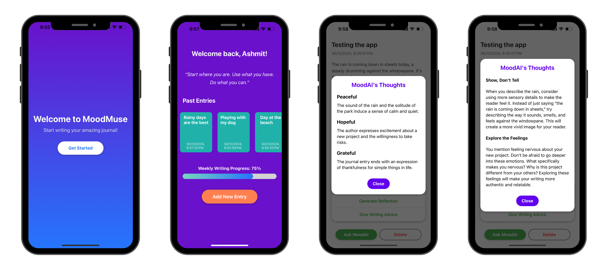

# MoodMuse - AI Powered Journal App

This AI-Powered Journal App is designed to be your personal journal assistant, combining the power of AI to provide insights, writing suggestions, and mood analysis for your daily entries. The app offers an aesthetically pleasing and user-friendly interface, enabling seamless journaling.

## UI Mockups

## Technologies Used

- **React Native:** For the mobile app interface.
- **Expo:** For simplified app development and testing.
- **AsyncStorage:** For secure, local storage of journal entries.
- **Gemini API:** For AI-powered analysis of journal content.
- **Lottie Animations:** For visually appealing loading indicators.
- **Markdown Display:** For rendering AI responses beautifully.
